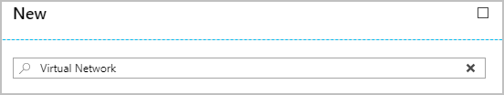
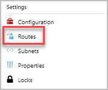
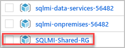
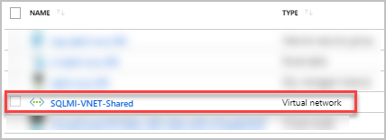
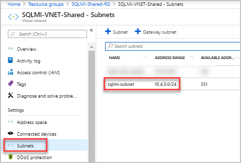
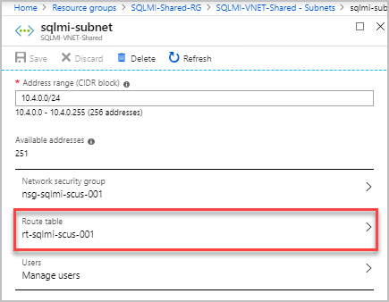
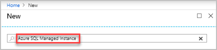
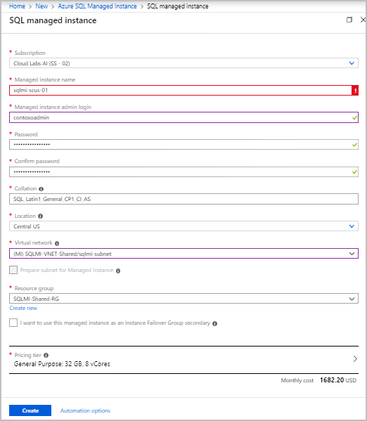
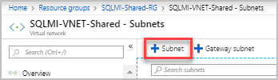

Azure SQL Managed Instance

March 2019

Introduction
------------

This lab walks you through the steps in creating an Azure virtual network (VNet)
for Azure SQL Database Managed Instance. The deployment of a VNet enables the
following scenarios:

-   Connecting to a Managed Instance directly from an on-premises network

-   Connecting a Managed Instance to linked server or another on-premises data
    store

-   Connecting a Managed Instance to Azure resources

For more
information: <https://docs.microsoft.com/en-us/azure/sql-database/sql-database-managed-instance-vnet-configuration> 

SQL Managed Instance
====================

Exercise 0: Verify the Environment
----------------------------------

### Overview

In this exercise, you will connect to your Azure Portal and verify the
Pre-deployed Resource group’s.

#### Task 1: Connect to Azure Portal

1.  Launch a browser and navigate to <https://portal.azure.com>. Once prompted,
    login with the Azure Credentials from the Lab Details Page.  
    

    

2.  In the Stay signed in? pop-up window, click No

3.  In the Welcome to Microsoft Azure pop-up window, click Maybe Later

    Note: If you receive a pop-up for Azure Advisor, click the X in the top
    right corner of the pop-up to close it.

4.  You will be directed to the dashboard.

5.  From the left side of the Page, select Resource Groups

6.  Note that you will have access to three Resource groups:  
    

    

Exercise 1: Configure Network Environment
-----------------------------------------

### Overview

The following tasks will show you how to create and Configure Network for your
Managed Instance.

Note: The resources have been pre-created for you as per the planned lab
environment.

The following steps cannot be performed on the SQLMI-Shared-RG and are for
reference only.

#### Task 1: Create a Virtual Network

1.  In your browser, navigate to the **Azure
    Portal** ([https://portal.azure.com](https://portal.azure.com/)).

2.  Once prompted, login with the Azure Credentials from the Lab Details Page.

3.  Select **+ Create a resource** in the navigation bar at the left.  
    

    

4.  In the Search the Marketplace search box, type "**Virtual Network**" and
    press Enter.

1.  In the **Virtual Network** blade, click **Create**

2.  On the **Create virtual network** blade, enter the following:

    1.  Name**:** **SQLMI-VNET-Shared**  
        **Note:** You may need to slightly adjust the name if it already exists

    2.  Address space**:** **10.4.0.0/16**

>   **Note:** A Virtual Network will support any valid address range, such as
>   10.14.0.0/24

1.  **Subscription:** leave the default setting

2.  **Resource Group:** Select **SQLMI-Shared-RG**

3.  **Location:** choose **location of your Resource Group**

4.  **Subnet name:** **sqlmi-subnet**

5.  **Subnet address range:** **10.4.1.0/24**

>   **Note:** A subnet will support any valid address range, such as
>   10.14.0.0/28. Use a subnet address space **smaller** than the **address
>   space** itself to allow space to create other subnets in the same virtual
>   network, such as a subnet used for hosting a **Virtual Machine**

1.  **DDoS protection**: select **Basic**

2.  **Service endpoints:** select **Disabled**  
    

    

>   **Note:** As per the planned lab environment, we have Pre-created the
>   Virtual Network for you.

>   You can still click on Create, but you will get a validation error as
>   resource is already pre-provisioned.

>   **Note:** The Virtual network resource has already been pre-created for you

>   **Note:** The pre-created Virtual network is: **SQLMI-VNET-Shared**

1.  On the **Create virtual network** blade, click the **X** to close
    the **Create virtual network** blade, click **OK** to the unsaved edits will
    be discarded dialog

#### Task 2: Create a new route table and a route

1.  Select **+ Create a resource** in the navigation bar at the left.  
    

    

2.  In the Search the Marketplace search box, type "**Route table**" and press
    Enter.

3.  Click **Create a resource** in the upper left-hand corner of the Azure
    portal.

4.  Click **Route table**

5.  In the **Route table** blade, click **Create**

6.  On the **Create Route table** blade, provide the following information:

    1.  **Name:** **rt-sqlmi-scus-001**

>   **Note:** You may need to slightly adjust the name if it already exist

1.  **Subscription:** leave the default setting

2.  **Resource Group:** select **SQLMI-Shared-RG**

3.  **Location:** Provide Resource Group Location

4.  **BGP route propagation:** select **Enabled**

>   **Note:** As per the planned lab environment, we have Pre-created the Route
>   table for you.

>   You don’t have to click on create the route table.

>   **Note:** The Route table resource has already been pre-created for you 

1.  In the navigation bar on the left, select **All resources** and
    click **OK** to the unsaved edits will be discarded dialog

2.  In the **All resources** blade click on the resource with type **Route
    table**

3.  Under **Settings** in the left-hand column, click **Routes**  
    

    

>   **Note:** As per the planned lab environment, we have Pre-created the Route
>   for you.

>   **Note:** The Routes has already been pre-created for you

>   **Note:** Due to the limited permissions in this lab, you are unable to add
>   a new route. Instead the route resource has been pre-created for you, which
>   you may click on to view.

#### Task 3: Apply the route table to the Managed Instance subnet

1.  In your browser, navigate to the **Azure
    Portal** ([https://portal.azure.com](https://portal.azure.com/)).

2.  Once prompted, login with the Azure Credentials from the Lab Details Page.

3.  Select **Resource Groups** in the navigation bar at the left.

4.  Click on **SQLMI-Shared-RG**  
    

    

5.  Select the pre-configured Virtual Network, **SQLMI-VNET-Shared** from the
    resources list.  
    

    

6.  Under the **Settings** section click **Subnets** and then click
    on **sqlmi-subnet**  
    

    

7.  The route table has already been added before:  
    

    

>   **Note:** As per the planned lab environment, we have added the Route table
>   for you.

Exercise 2: Create Managed Instance
-----------------------------------

### Overview

*The following steps will show you how to create your own Managed Instance
inside of your Virtual Network.*  
Note: The resources have been pre-created for you as per the planned lab
environment.

The following steps cannot be performed on the SQLMI-Shared-RG and are for
reference only.

#### Task 1: Create Managed Instance

1.  Select **+ Create a resource** in the navigation bar at the left.  
    

    

2.  In the Search the Marketplace search box, type "**Azure SQL Managed
    Instance**" and press Enter and then Click **Azure SQL Managed Instance**.  
    

    

3.  In the **Azure SQL Managed Instance** blade, click **Create**

4.  In the Create SQL Managed Instance Blade, provide the following information:

    1.  **Subscription:** leave the default setting

>   Note: Verify that the preview terms show **Accepted**

1.  **Managed Instance Name:** **sqlmi-scus-01**

2.  **Managed Instance admin login**: **contosoadmin**

3.  Password: **IAE5fAijit0w\^rDM**

4.  Confirm password: **IAE5fAijit0w\^rDM**

5.  **Resource Group:** select **SQLMI-Shared-RG**

6.  **Location:** choose **location of your resource group**

7.  **Virtual Network:** in the dropdown box select **(MI)
    SQLMI-VNET-Shared/sqlmi-subnet**

8.  Click **Pricing tier** to size compute and storage resources as well as
    review the pricing tier options

9.  Configure the sizing of your managed instance by using the sliders or text
    boxes under **Storage**

>   **Note:** By default, your instance gets 32 GB of storage space for free

1.  Ensure the slider is set to **32 GB**

2.  Configure your compute resources by using the sliders or text boxes
    under **vCores** (also known as "Virtual Cores")

3.  Ensure the slider is set to **8 vCores**.

4.  When finished configuring your storage and compute resources,
    click **Apply** to save your selections and return to the SQL Managed
    Instance configuration menu

>   **Note:** As per the planned lab environment, we have Pre-created the
>   Managed Instance for you.

>   You don’t have to click on create.

>   **Note:** The Managed Instance resource has already been pre-created for
>   you 

#### Task 2: Create a Virtual Machine in the new subnet in the VNET

Since SQL Managed Instance is placed in a private Virtual Network, you need to
create an Azure VM attached to that network with some installed SQL client tool
like SQL Server Management Studio or SQL Operations Studio to connect to the
Managed Instance and execute queries.

The following steps create a new subnet in the Managed Instance VNet for an
Azure virtual machine to connect to the Managed Instance. The Managed Instance
subnet is dedicated to Managed Instances and you cannot create any other
resources (for example Azure Virtual Machines) in that subnet.

Note: The resources have been pre-created for you as per the planned lab
environment.

The following steps cannot be performed on the SQLMI-Shared-RG and are for
reference only.

1.  In your browser, navigate to the **Azure
    Portal** ([https://portal.azure.com](https://portal.azure.com/)).

2.  Once prompted, login with the Azure Credentials from the Lab Details Page.

3.  Select **Resource Groups** in the navigation bar at the left.

4.  Click on **SQLMI-Shared-RG**  
    

    

5.  Select the pre-configured Virtual Network, **SQLMI-VNET-Shared** from the
    resources list.  
    

    

6.  Under the **Settings** section click on **+ Subnet**   
    

    

7.  Provide the following information in the Add Subnet Blade:

    1.  Name: **vm-subnet**

    2.  Address range (CIDR block): **10.4.1.0/24**

8.  Click the **X** to close the **Add Subnet** blade

9.  We have already pre-created this subnet and pre-created an Azure VM
    connected to the **vm-subnet** subnet in the **sqlmi-onpremises-UserID**
    Resource group

>   **Note:** For the purposes of this lab VM creation steps will not be
>   covered.

Conclusion
----------

#### You have successfully deployed your Managed Instance and are now ready to migrate data.
