Migration Using Azure SQL Managed Instance

March 2019

Introduction
------------

Azure SQL Database Managed Instance is a new deployment model of Azure SQL
Database, providing near 100% compatibility with the latest SQL Server
on-premises (Enterprise Edition) Database Engine. Managed Instance allows
existing SQL Server customers to lift and shift their on-premises applications
to the cloud with minimal application and database changes. At the same time,
Managed Instance preserves all PaaS capabilities (automatic patching and version
updates, automated backups, high-availability ), that drastically reduces
management overhead and TCO. This lab walks you through the steps to create a
Managed Instance.

For more
information: <https://docs.microsoft.com/en-us/azure/sql-database/sql-database-managed-instance-get-started> 

Migration using SQL Managed Instance
====================================

Exercise 0: Verify the Pre-deployed resources
---------------------------------------------

### Overview

You are given access to a pre-deployed SQL Managed Instance and SQL Server 2008
VM along with Data Migration Service which is pre-deployed in Azure

#### Task 1: Connect to Azure Portal

1.  Launch a browser and navigate to <https://portal.azure.com>. Once prompted,
    login with the Azure Credentials from the Lab Details Page.

2.  In the Stay signed in? pop-up window, click No

3.  In the Welcome to Microsoft Azure pop-up window, click Maybe Later

    Note: If you receive a pop-up for Azure Advisor, click the X in the top
    right corner of the pop-up to close it.

4.  You will be directed to the dashboard.

5.  From the left side of the Page, select Resource Groups

6.  Note that you will have access to three Resource groups:  
    

    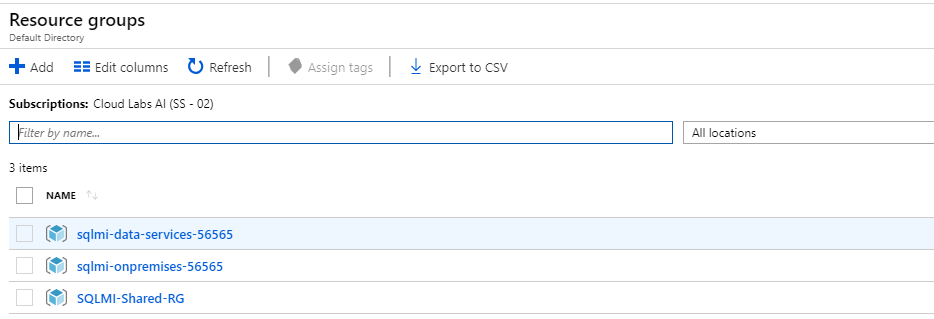

7.  SQL Server 2008 VM is deployed in ODL-onpremises-\*\*\*\*\* Resource group
    and the SQLMI-Shared-RG has Managed Instance. Resource Group named
    sqlmi-data-services-\*\*\*\* contains Data Migration Service and Azure Data
    Factory

Exercise 1: View and Backup the Database
----------------------------------------

### Overview

In this lab we are focusing on the offline database migration of an SQL 2008
database from "on-premises" to an Azure SQL Managed Instance (SQL-MI).

This lab does not address:

\* On-premise connectivity to Azure via virtual network gateway or ExpressRoute

\* Secure Azure Virtual Network connectivity configuration for on-premises
connectivity

#### Task 1: View the data

1.  Launch Azure Portal and Browse through Virtual Machine

2.  Open Virutal Machine named lab-sql-vm

    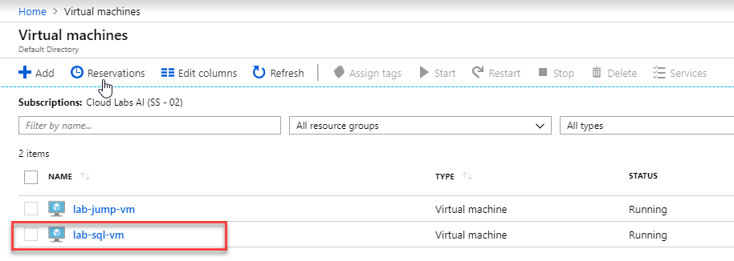

3.  Click on Connect and Download RDP File. Launch the RDP file once downloaded.

    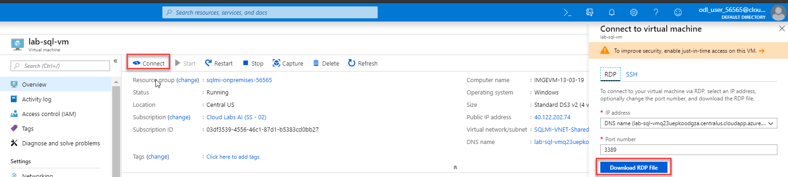

4.  Use **demouser** as username as **demopassword1!** as password when
    connecting.

5.  Open SSMS ( SQL Server Management Studio ) from the SQL Server VM to launch
    SQL Server 2008 Management application

    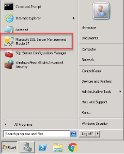

6.  On the Connect to Server dialog click the Authentication drop down and
    choose **SQL Server Authentication. Leave Server Name as default**

7.  Enter “**labuser”** for Login

8.  Enter “**demopassword1**!” for the Password and click **Connect**

    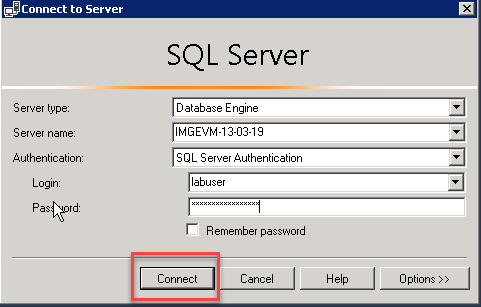

9.  In SQL Server Management Studio's Object Explorer tree view open the
    Databases node. You should see a database named **AdventureWorksLT2008R2.**
    We need to rename this database first to avoid conflict when migrating to MI
    with other users in the class. Right Click on the database name and Click
    **Rename.**

    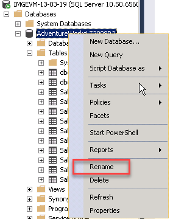

10. Add your Name or deploymentID(In Azure Portal, your resource group ends with
    a number), you can use any of these as suffix to **AdventureWorksLT2008R2**
    and click **Enter**.

11. Drill down to the SalesLT.SalesOrderDetail table in the object explorer tree
    by double clicking on Databases, **AdventureWorksLT2008R2**, Tables

12. Right click on SalesLT.SalesOrderDetail and choose Select Top 1000 Rows

13. Make a note of the row count on the bottom right of the results windows.

    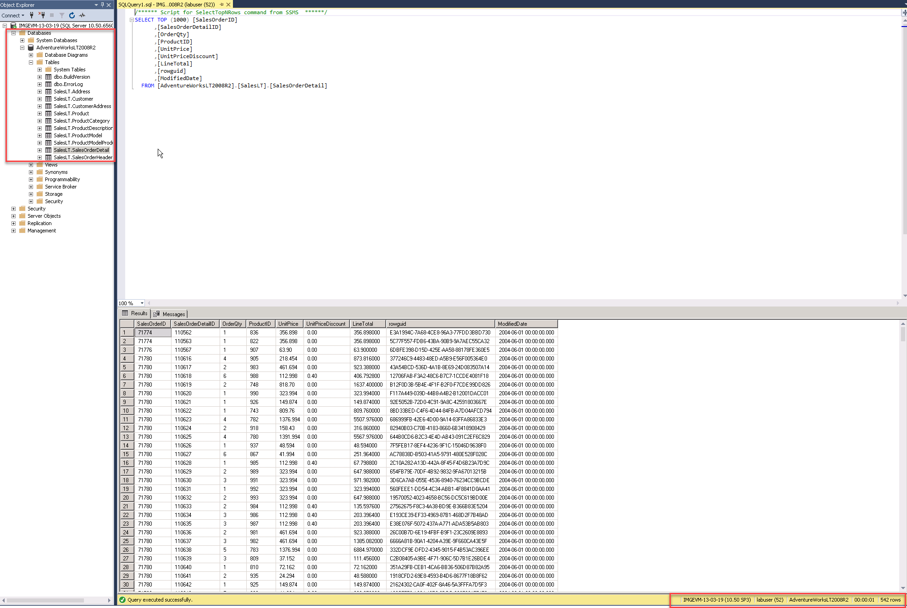

#### Task 2: Backup the database

Azure Data Migration Service will use the backup file to initialize the target
database before starting the process of capturing the oning transactions. In
this section we will create the backup which contains the schema and data.
Azure's Data Migration Service requires that your backup has Perform checksum
enabled so we need to make sure that is turned on.

1.  In object explorer right click on the database **AdventureWorksLT2008R2,**
    and select **New Query**

2.  In the query window **enter** the following Transact SQL (T-SQL) to create
    the backup file and press execute

USE [master]

ALTER DATABASE [AdventureWorksLT2008R2] SET RECOVERY FULL WITH NO_WAIT

BACKUP DATABASE [AdventureWorksLT2008R2] TO DISK = N'c:\\Backup\\aw.bak' WITH
NOFORMAT, NOINIT, NAME = N'AdventureWorks-Full Database Backup', SKIP, NOREWIND,
NOUNLOAD, STATS = 10, CHECKSUM declare \@backupSetId as int select \@backupSetId
= position from msdb..backupset where database_name=N'AdventureWorksLT2008R2'
and backup_set_id=(select max(backup_set_id) from msdb..backupset where
database_name=N'AdventureWorksLT2008R2' ) if \@backupSetId is null begin
raiserror(N'Verify failed. Backup information for database
''AdventureWorksLT2008R2'' not found.', 16, 1) end RESTORE VERIFYONLY FROM DISK
= N'c:\\Backup\\aw.bak' WITH FILE = \@backupSetId, NOUNLOAD, NOREWIND

1.  Congratulations you have backed up the AdventureWorks database. Next we will
    run the Data Migration Assistant to check on database compatibility. Backup
    is stored in C:\\Backup\\aw.bak

    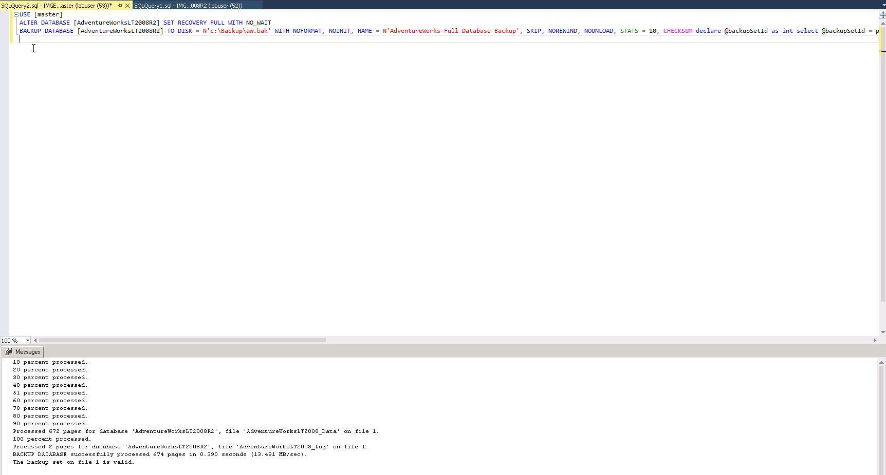

Exercise 2: Check Database Compatibility for Migration
------------------------------------------------------

### Overview

#### A best practice is to download and run this Microsoft’s Data Migration Assistant in order to see if there are any issues that you may encounter before you start down the path of migration. 

#### Task 1: Check with Microsoft’s Data Migration Assistant

1.  Minimize the Sql Server Management Studio window to see the Desktop. We will
    come back to SSMS later.

2.  Double click the Microsoft's Data Migration Assistant desktop icon to launch
    Microsoft's Data Migration Assistant

3.  On the left column near the top click the plus "**+**" sign to start a new
    project

4.  Under Project type Assessment should be selected

5.  For Project name enter the following **SQL2008 to SQL-MI**

6.  Source server type **SQL Server** should be selected

7.  For Target server type click the drop down and select **Azure SQL Database
    Managed Instance**

8.  Click **Create**

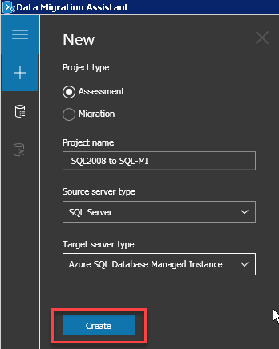

1.  On the next screen ensure Check database compatibility and Check feature
    parity are selected

2.  On the bottom right click **Next**

3.  On the right in the Connect to a server blade enter the following for Server
    name: **localhost**

4.  For Authentication type click the drop down and select **SQL Server
    Authentication**

5.  For Username enter the following: **labuser**

6.  For Password enter the following: **demopassword1!**

7.  Ensure both Encrypt connection and Trust server certificate are **checked**

8.  At the bottom click **Connect**

    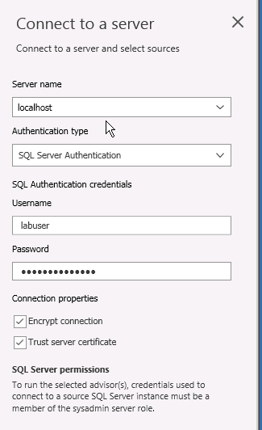

9.  On the next blade Add sources select **AdventureWorks** and click Add at the
    bottom

    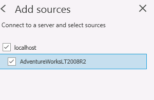

10. Click Start Assessment on the bottom right

11. You should see the result.

12. On the left under Options you may now click Compatibility issues and should
    see a similar successful notice

13. Click the X in the upper right to close the Data Migration Assistant
    application

14. On the pop-up question dialog click Yes to lose all the work

15. Congratulations you have delivered on a best practice.

    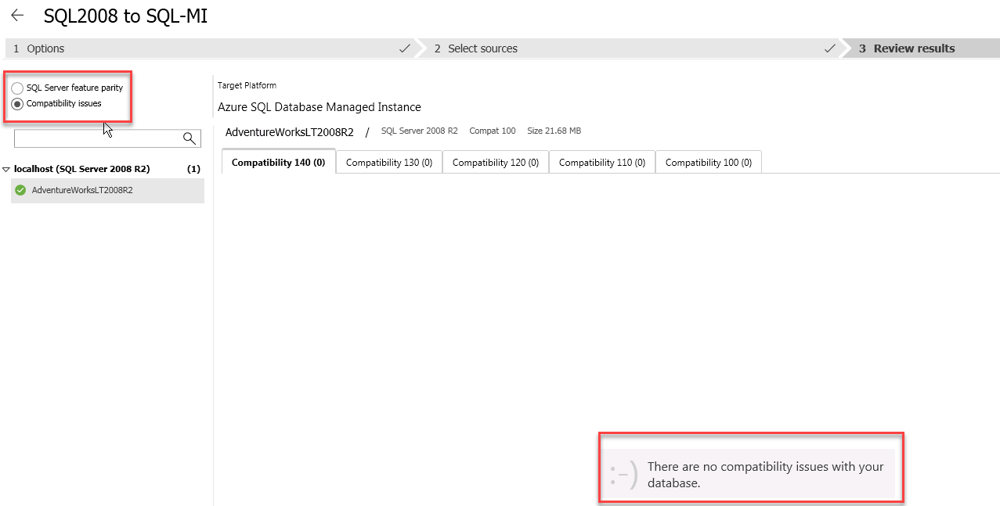

Exercise 3: Offline Data Migration
----------------------------------

### Overview

#### In offline migration mode you need to perform full backup which we did earlier. Configure and srun the DMS activity. DMS will take these files from local share, upload it to Azure Storage account, and then restore the database on SQL MI.  Follow these steps to create a DMS migration project and start the migration. This is the bulk of the demo and has a lot of instructions so be sure to keep scrolling down until you are done. 

#### Task 1: Start Migration

  
**Create DMS Project**  

1.  Open the Azure portal browser session you created earlier

2.  On the Dashboard tile, select All resources, search **Azure Database
    Migration Services** and select the resource you have access, to open the
    Data Management Service

    Note: The Overview information shows the Virtual network information. For
    DMS to work it needs connectivity to both the source and destination
    databases.

3.  You should see a pre-created DMS Service. Open that.

    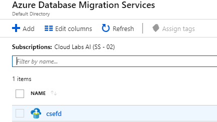

4.  On the DMS blade at the top click **+ New Migration Project**

    Note: If the button is grayed out, there is also a 'New Migration Project'
    button toward the middle of the window.

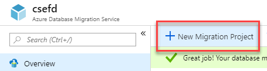

1.  On the New migration project blade, for Project name enter
    SQL-2008-XPRESSMigrate-2008

2.  For Source server type select SQL Server

    Note: This drop down shows the current list of supported databases.
    Microsoft will continue to add to this list. Based on the source you choose,
    the Target server type populates with supported targets.

3.  For the Target server type choose **Azure SQL Database Managed Instance**

4.  Click on Choose type of activity to review the list of options. Select
    **Offline data migration**

    Note: Different Source and Targets may have different options for activity
    (example: schema only migration). As Microsoft continues to improve DMS this
    drop down will have more migration activity options.

5.  On the Type of activity blade choose **Save**

6.  On the bottom of New migration project blade choose **Create and run**
    activity

    Note: You have just created the DMS project and now the Migration Wizard is
    being launched.

    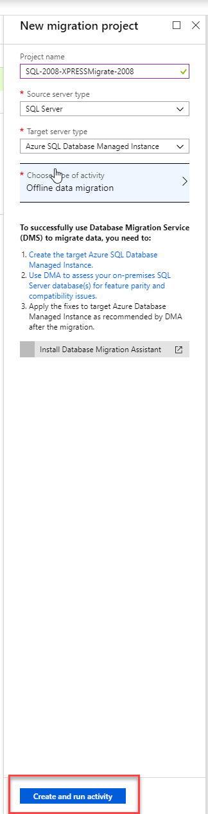

      
      
    **Migration Source Details**  
    

7.  On step 1 Select source, in the Migration Source Details blade, in the
    Source SQL server instance name field enter IP Address/DNS Name of the SQL
    Server 2008 VM used in Task-1 to connect to SQL Server VM via RDP

8.  For Authentication type select **SQL Authentication**

9.  For User Name enter **labuser**

10. For Password enter **demopassword1!**

11. Ensure both Encrypt connection and Trust server certificate are selected

12. Click **Save** at the bottom of the pane

    Note: DMS will test SQL connectivity to the source server.

    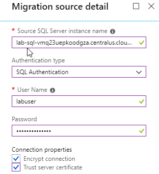

    **Migration Target Details**  
    

13. On step 2, Select target, For Target Server Name, Find the DNS name of
    managed instance.  
    On the Dashboard tile, select All resources, search **SQL Managed Instance**
    and available database managed instance.

    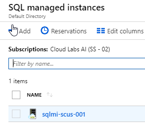

14. Click on available manaed instance and copy the Hostname.

    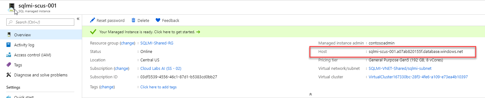

15. For the Authentication Type, select **SQL Authentication** from the drop
    down.

16. Provide “**contosoadmin**” as the User Name

17. Provide “**IAE5fAijit0w\^rDM**” as the Password

18. Click **Save** at the bottom of this blade

    **Map to target databases**  
    

19. On step 3, Select databases, In the list of SOURCE DATABASE ensure only
    **AdventureWorks**\*\*\*\*\* is selected

20. Click **Save** at the bottom of this blade  
      
    **Select Logins**

21. Check Source Logins and then click on **Save**  
      
    **Configure Migration settings**

    This dialog give DMS the information it needs to access the backup file you
    created earlier. The location, username and password will be used to access
    the backup file. The storage account will be used while DMS is performing
    the migration.

    Click on Configure migration settings and enter the following details.

22. Choose source backup options: I will let Azure Database Migration Service
    create backup files.

23. Network share location that Azure Database Migration Service can take
    database backups to: \\\\{**SQLServerVMDNSName**}\\Backup

24. Windows User Azure Database Migration Service impersonates to upload files
    to Azure Storage: **.**\\**demouser**

25. Password: **demopassword1**!

26. Now navigate to Azure Portal in a new **browser Tab**. Select Storage
    Accounts from the left side and select the storage account with name such as
    **sqlmistore\*\*\*\*\*\*\***.

27. Click on Blobs

28. Then Create a container in that storage account with name such as
    **dbstore**.

    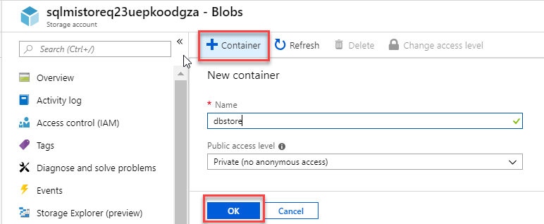

29. Now, Click on **Storage Explorer,** Expand Blob Containers and right click
    on the newly created container named **dbstore.** On Right click, Click Get
    **Shared Access Signature**.

    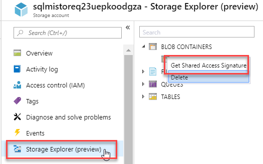

30. Specify Date and Time, Ensure to check all boxes including write and delete.
    It is advised to take a day before current date as start date to avoid any
    time zone issues.

    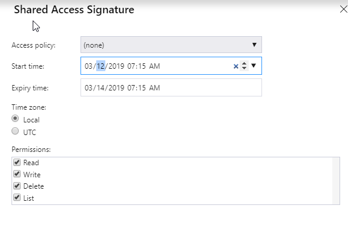

31. Copy the SAS URL

    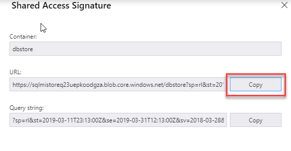

32. Paste this URL on the Database migration settings

33. Click on **Save**.

    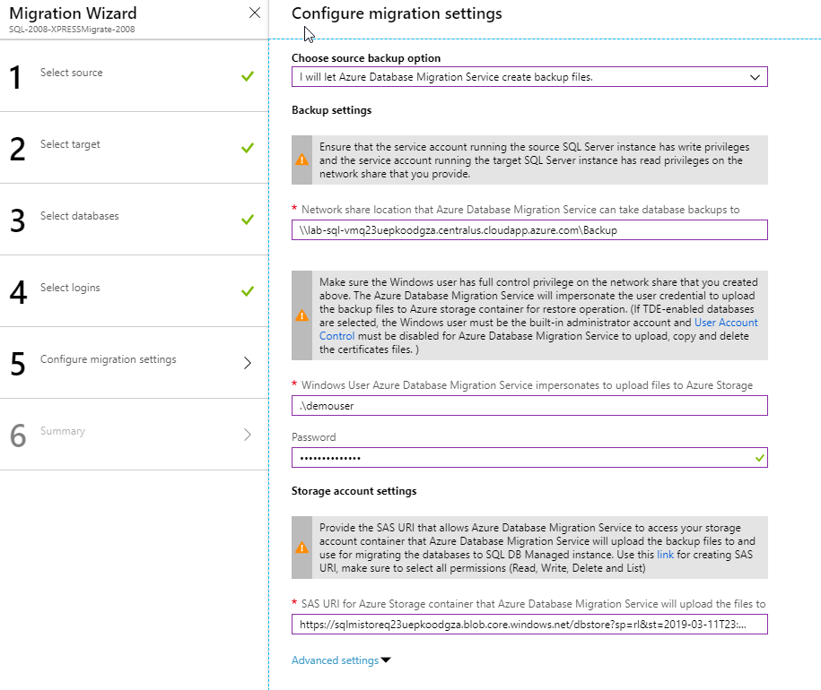

    **Migration summary**  
    

34. Now enter the following details.

    Activity Name: **migration**-**activity**

    Validation option: **Do not validate**

35. Now click on **Run migration**  
    

    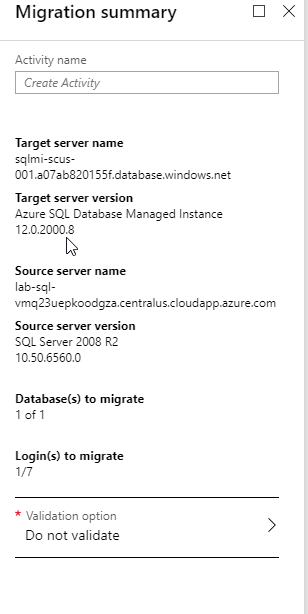

      
    Congratulations, you have successfully configured and started a migration
    project.

#### Task 2: Connect to SQL-MI and Verify

This task will have you connect to the SQL Managed Instance and verify the
record count. The will complete the demo. Existing applications will need to
point their connections to the Azure SQL Managed Instance database vs. the
on-premises database and verify the application is still working.

There are many techniques we can use to make this switch over happen very
quickly and mitigate down time that you may want to discuss with the audience.

Some discussion topics are:

\* Ensure the connection string is a config value and not hard-coded.

\* Script the changing of the connection string.

These instructions will demonstrate how to connect to the SQL Managed Instance.

1.  Go back to the SQL Server Management Studio application in SQL Server 2008
    VM. In Object Explorer on the left **click** the **connect** icon

2.  In the Connect to Server dialog leave **Server type** as **Database Engine**

3.  In Server Name Enter the following **the database managed instance hostname
    copied earlier.**

4.  For Authentication ensure **SQL Server Authentication** is selected

5.  Provide “**contosoadmin**” as the User Name

6.  Provide “**IAE5fAijit0w\^rDM**” as the Password

7.  Click **Connect**  
    

    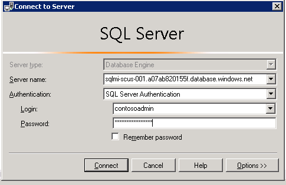

      
    **Verify Results**  
    

    Now we will verify that all rows have been copied

8.  Under Object Explorer, Expand Databases and Select the database name you
    migrated.

9.  Drill down to the SalesLT.SalesOrderDetail table in the object explorer tree
    by double clicking on your Database name,
    **AdventureWorksLT2008R2-yourcustomsuffix**, Tables

10. Right click on SalesLT.SalesOrderDetail and choose Select Top 1000 Rows

11. Make a note of the row count on the bottom right of the results windows.

    The total number of records in the result set (bottom right) should match
    the ones from the source.

    Congratulations on a successful migration of SQL Server 2008 to SQL Managed
    Instance.

12. In Next Step, We’ll do online migration. In order to do that, We’ll delete
    the currently migrated DB from Managed Instance to avoid name conflict.
    Right Click on your Database name
    **AdventureWorksLT2008R2-yourcustomsuffix** under managed instance and click
    **Delete**. Be sure not to delete the database from on-premesis.

Exercise 4: Online Data Migration

Overview

In online migration mode you need to perform full backup which we did earlier.
Configure and run the DMS activity. Then when performing cut over the
incremental transaction log backups will be processed. DMS will take these files
from local share, upload it to Azure Storage account, and then restore the
database on SQL MI - starting from the last full backup, and then applying all
incremental transaction log backups.

#### Task 1: Start Migration

**Create DMS Project**  

1.  Open the Azure portal browser session you created earlier

2.  On the Dashboard tile, select All resources, search **Azure Database
    Migration Services** and select the resource you have access, to open the
    Data Management Service

    *Note:* The Overview information shows the Virtual network information. For
    DMS to work it needs connectivity to both the source and destination
    databases.

3.  On the DMS blade at the top click **+ New Migration Project**

    **Note**: If the button is grayed out, there is also a 'New Migration
    Project' button toward the middle of the window.

4.  On the **New migration project** blade, for Project name enter
    **Migrate-2008**

5.  For Source server type select **SQL Server**

    Note: This drop down shows the current list of supported databases.
    Microsoft will continue to add to this list. Based on the source you choose,
    the Target server type populates with supported targets.

6.  For the Target server type choose **Azure SQL Database Managed Instance**

7.  Click on Choose type of activity to review the list of options. Select
    **Online data migration**  
    

    Note: Different Source and Targets may have different options for activity
    (example: schema only migration). As Microsoft continues to improve DMS this
    drop down will have more migration activity options.

8.  On the Type of activity blade choose **Save**

9.  On the bottom of **New migration project** blade choose **Create and run
    activity**  
    

    Note: You have just created the DMS project and now the Migration Wizard is
    being launched.  
      
    **Migration Source Details**  
    

10. On step 1 Select source, in the Migration Source Details blade, in the
    Source SQL server instance name field enter IP Address/DNS Name of the SQL
    Server 2008 VM same way we did earlier.

11. For Authentication type select **SQL Authentication**

12. For User Name enter **labuser**

13. For Password enter **demopassword1!**

14. Ensure both **Encrypt connection** and **Trust server certificate** are
    selected

15. Click **Save** at the bottom of the pane

    Note: DMS will test SQL connectivity to the source server.

    **Migration Target Details**  
    

Live migration to SQL-MI requires an execution context. Azure Active Directory
allows you to create Application ID's and key which provide that context. We
have prepared one for you to use and added it with reader access to the SQL
Managed Instance.

1.  Application ID: **07578465-0b15-4dee-8837-36429dc8f7f7**

2.  Key: **1cwICTDn2iAPlagSj9Lu0gnpl89GlDmkXEykMztO4n4=**

3.  The subscription should be defaulted to your current subscription

4.  For Select target Azure SQL Database Managed Instance, select the **managed
    instance** one listed in the drop down

5.  Provide “**contosoadmin**” as the User Name

6.  Provide “**IAE5fAijit0w\^rDM**” as the Password

7.  Click **Save** at the bottom of this blade.

    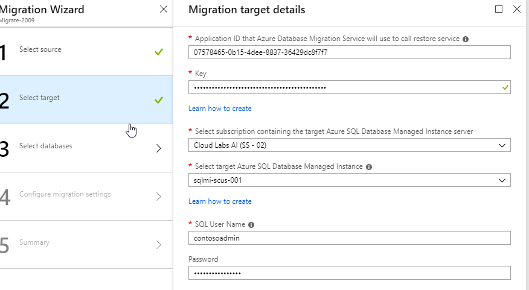

Note: DMS will now validate connectivity to the target server. These properties
are also viewable on the overview pane of the Azure DMS service.

**Map to target databases**  

1.  On step 3, Select databases, In the list of SOURCE DATABASE ensure only
    **AdventureWorks**\*\*\*\*\* is selected

2.  Click **Save** at the bottom of this blade  
      
      
    **Configure Migration settings**

    This dialog give DMS the information it needs to access the backup file you
    created earlier. The location, username and password will be used to access
    the backup file. The storage account will be used while DMS is performing
    the migration.

    Click on Configure migration settings and enter the following details.

3.  Network share location that Azure Database Migration Service can take
    database backups to: \\\\{**SQLServer2008VM_DNSName**}\\Backup

4.  Windows User Azure Database Migration Service impersonates to upload files
    to Azure Storage: **.**\\**demouser**

5.  Password: **demopassword1**!

6.  For subscription use the default which should already be selected for you

7.  For Storage account click the drop down and select available storage account
    name such as  **sqlmistore\*\*\*\*\*\***

8.  On the bottom click **Save**

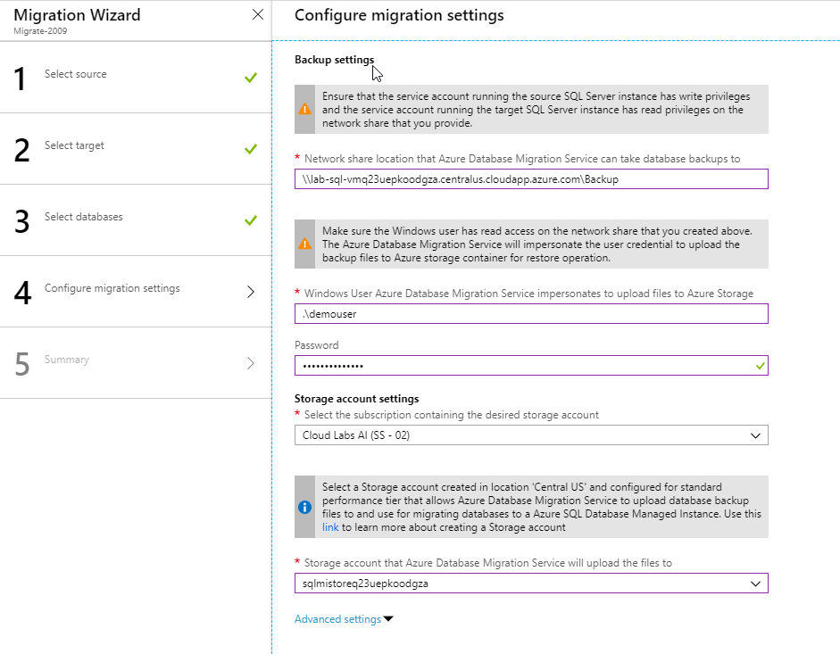

**Migration summary**  

1.  Now enter the following details.

    Activity Name: **Migrate2Azure**

2.  Now click on **Run migration** at the bottom of this blade.

    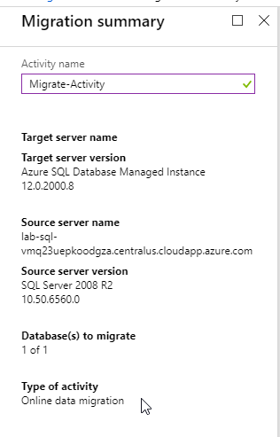

3.  Wait a few seconds then click refresh on the upper left of the blade.  
      
    Congratulations, you have successfully configured and started a migration
    project.

####  Task 2: Cutting over to Azure [IN PROGRESS]

We have started the execution of the migration job specifically DMS is
processing the full backup. You will need to click refresh multiple times as it
can take up to a minute for these activities to start. The actual data movement
once initialized runs pretty quickly and keeps updating the target with changes
based on the transaction logs DMS sees on the share you provided.

We have experienced no downtime up till now. The cut over process will cause a
minimal amount of downtime as we drop all connections to the database, process
the final transaction log (known as the tail) move them to the cloud.

If the database is isolated from direct access the only switchover is the
service tier connection. Any applications that use the old database will need to
update their database configuration to point to the new Azure database.

These steps will help you complete the cutover. We will stop the load, put the
database into SINGLE_USER mode and backup the last transactions. Since DMS is
monitoring that share it will automatically upload the transaction log and apply
it to the current database copy on SQL MI.

As soon as the transaction log is processed we will perform the cutover in DMS
and the SQL-MI database will become available for read-write.

**Monitor Progress**

On the activity blade and will need to use the refresh button to monitor the
progress

1.  Under Database Name, Click on the **AdventureWorks,** to see the details of
    the migration

2.  You can see the database files that have been processed here. Let’s start
    the cutover.

>   **Creating the final transaction Log**

We will now backup the transaction log (tail) for the last set of records that
have been written to the database. Since this is the final operation for this
database we need to ensure there are no other connections to the database. We
will accomplish this by setting it to SINGLE_USER mode where our backup will be
the only user. Please follow these instructions exactly.

1.  In object explorer right click on the database **AdventureWorksLT2008R2**
    and select **New Query**

2.  In the query window enter the following Transact SQL (T-SQL) to create the
    tail-log backup file and press execute.

USE [master]

ALTER DATABASE [AdventureWorksLT2008R2] SET SINGLE_USER WITH ROLLBACK IMMEDIATE;
BACKUP LOG [AdventureWorksLT2008R2] TO DISK = N'C:\\Backup\\aw-tail.bak' WITH
NO_TRUNCATE , NOFORMAT, NOINIT, NAME = N'AdventureWorks-Full Database Backup',
SKIP, NOREWIND, NOUNLOAD, NORECOVERY , STATS = 10, CHECKSUM declare
\@backupSetId as int select \@backupSetId = position from msdb..backupset where
database_name=N'AdventureWorks' and backup_set_id=(select max(backup_set_id)
from msdb..backupset where database_name=N'AdventureWorks' ) if \@backupSetId is
null begin raiserror(N'Verify failed. Backup information for database
''AdventureWorksLT2008R2'' not found.', 16, 1) end RESTORE VERIFYONLY FROM DISK
= N'C:\\Backup\\aw-tail.bak' WITH FILE = \@backupSetId, NOUNLOAD, NOREWIND

>   **Perform Cutover**

1.  On the Azure portal at the top left of the **migration activity** blade
    click **Refresh**

2.  Click on database named **AdventureWorksLT2008R2-Suffix**

>   You should see the new file **aw-tail.bak** show up. We need to wait for its
>   status to be **Restored** before we can start the cut over. This may take up
>   to 5 minutes.

1.  Click **Start Cutover** when aw-tail.back is **Restored**

2.  On the Complete cutover check the **[ ]Confirm** box and click Apply

>   DMS will now complete the process of cutting over to the Azure database and
>   finish the migration activity. The source database will also be marked as
>   Restoring.

1.  Wait until the progress bar at the bottom indicates **Completed**

2.  click the **X** at the top right to close the Complete cutover pane

3.  On the Migrate2Azure pane click the **X** in the top right of the
    Migrate2Azure pane to close it

>   On the **Migrate2Azure** pane the STATUS should be **Completed**

Great job, you have completed the cut over to Azure for your database migration.

#### Task 3: Connect to SQL-MI and Verify

This task will have you connect to the SQL Managed Instance and verify the
record count. The will complete the demo. Existing applications will need to
point their connections to the Azure SQL Managed Instance database vs. the
on-premises database and verify the application is still working.

There are many techniques we can use to make this switch over happen very
quickly and mitigate down time that you may want to discuss with the audience.

Some discussion topics are:

\* Ensure the connection string is a config value and not hard-coded.

\* Script the changing of the connection string.

These instructions will demonstrate how to connect to the SQL Managed Instance.

1.  Go back to the SQL Server Management Studio application in SQL Server 2008
    VM. In Object Explorer on the left **click** the **connect** icon

2.  In the Connect to Server dialog leave **Server type** as **Database Engine**

3.  In Server Name Enter the SQL Server MI Hostname used earlier

4.  For Authentication ensure **SQL Server Authentication** is selected

5.  Provide “**contosoadmin**” as the User Name

6.  Provide “**IAE5fAijit0w\^rDM**” as the Password

7.  Click **Connect**  
      
    **Verify Results**  
    

    Now we will verify that all rows have been copied

8.  Open the SQL Server Manager Studio application and select the SQL-MI Azure
    server connection

9.  Under Object Explorer, Expand Databases and Select the database name you
    migrated.

10. Drill down to the SalesLT.SalesOrderDetail table in the object explorer tree
    by double clicking on your Database name,
    **AdventureWorksLT2008R2-yourcustomsuffix**, Tables

11. Right click on SalesLT.SalesOrderDetail and choose Select Top 1000 Rows

12. Make a note of the row count on the bottom right of the results windows.

    The total number of records in the result set (bottom right) should match
    the ones from the source.

    Congratulations on a successful migration of SQL Server 2008 to SQL Managed
    Instance.

Exercise 5: Cloud Performance and Security
------------------------------------------

### Overview

Azure not only allows you to run your database in the cloud but Azure's
infrastructure brings additional capabilities for customers over running
on-premises.

Customers now have:

• Rapid response to scale-up or down their service

• Immediate benefits in security and performance capabilities

• Reduced cost and time to implement disaster recovery

• World wide footprint for growth

• Additional services like Machine Learning, A.I.Task 1: Connect to Azure Portal

Azure has a comprehensive environment for running your Postgres database. This
exercise is optional and will show you a few of the benefits of moving your
database to Azure.  
  
**Azure database features**

1.  On the Azure portal browser click Dashboard on the left side

2.  In the All resources tile click on the Azure SQL Managed Instance resource

3.  On the Overview pane you'll see a lot of service monitoring status
    information

4.  Under Security on the left side of the pane click on Advanced Data Security

5.  Under Security on the left side of the pane click on Transparent data
    encryption

    Note: you can bring your own key for SQL-MI providing increased level of
    protection and data ownership

    Azure provides a wealth of additional capabilities that you may instantly
    leverage in order to operate more securely and efficiently.

    Great Job!!

Conclusion
----------

#### Now that we have migrated the database all that remains is to perform standard testing and application cut over.

#### In this lab you have seen how easy it is to setup and migrate a live database with minimal downtime. Azure DMS makes it easy to migrate to Azure database services. Azure makes it easy to operate securely and improve performance as well as readily leverage the full cloud eco-system for value added services.

#### Additional resource links \| Additional Help

-   [An excellent SQL-MI technical
    article](https://blogs.technet.microsoft.com/hybridcloudbp/2018/11/02/migration-from-sql-server-to-azure-sql-database-managed-instance/) 

-   [SQL Compatibility
    levels](https://docs.microsoft.com/en-us/sql/t-sql/statements/alter-database-transact-sql-compatibility-level?view=sql-server-2017) 

-   [Supported
    scenarios](https://docs.microsoft.com/en-us/azure/dms/resource-scenario-status) 

-   [Tutorial SQL to SQL Managed
    Instance](https://docs.microsoft.com/en-us/azure/dms/tutorial-sql-server-managed-instance-online) 

-   [PowerSHell SQL to SQL Managed
    Instance](https://docs.microsoft.com/en-us/azure/dms/howto-sql-server-to-azure-sql-mi-powershell) 

-   [DMS service
    sizing](https://azure.microsoft.com/en-us/pricing/details/database-migration/) 
