Azure SQL MI PowerBI

March 2019

Introduction
------------

In this lab, you will learn key concepts in data integration centered on
orchestrating and operationalizing data movement and data transformation
activities, as well as cloud-based SSIS package execution via Azure Data
Factory's Integration Runtime feature. You will establish connections with both
on-premises SQL Server Databases, as well as Managed Instances in the cloud, to
allow the creation of data pipelines that run from your sources, all the way to
your destination. Then, you will lift-and-shift native SSIS packages onto the
cloud to allow for more seamless control and monitoring during executions.
Finally, you'll complete the journey of your data by establishing a connection
to a live Power BI Desktop report, where you will be able to visualize directly
the various components and insights contained in your data.

### Understanding Integration Runtime in Azure Data Factory

**Integration Runtime** (IR) *is the* **compute infrastructure** *used by Azure
Data Factory to provide the following data integration capabilities across
different network environments:*

-   **Data Movement:** Moving data between data stores in public and private
    networks.

-   **Activity Dispatch:** Monitoring transformation activities running on a
    variety of compute services.

-   **SSIS Package Execution:** Natively execute SQL Server Integration Services
    (SSIS) packages in a managed Azure compute environment.

*Azure Data Factory offers three types of Integration Runtimes that serve
specific data integration capabilities; Azure, Self-hosted, and Azure-SSIS. The
last type supports the previously mentioned SSIS Package Execution, which is
what we'll be using in this section of the lab.*

SQL Managed Instance – Power BI
===============================

Exercise 0: Provisioning an Azure-SSIS Integration Runtime in Azure Data Factory
--------------------------------------------------------------------------------

### Overview

#### This section will provide you with the ability to use the Azure Portal to create the foundation needed for the Integration Runtime's infrastructure to effectively host and manage the executions of SSIS packages residing virtually anywhere in the world.

#### Task 1: Configure Integration Runtime Setup

1.  Launch a browser and navigate to <https://portal.azure.com>. Once prompted,
    login with the Azure Credentials from the Lab Details Page.  
    

    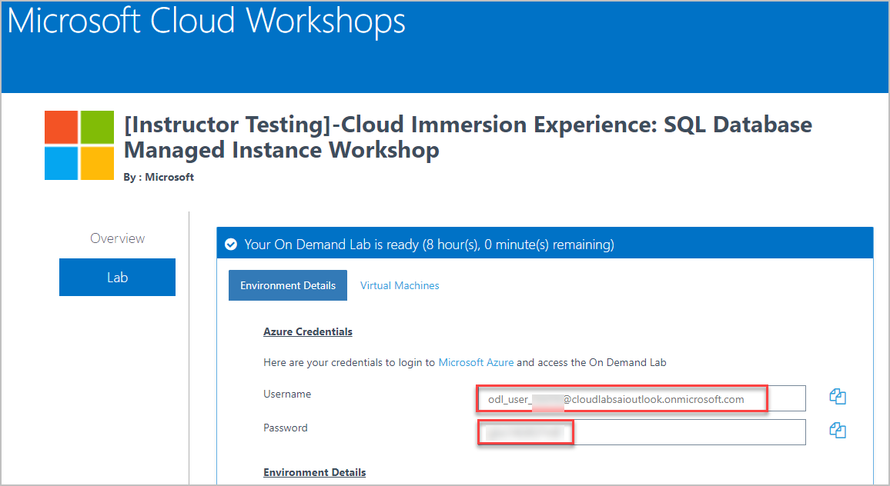

2.  In the Stay signed in? pop-up window, click No

3.  In the Welcome to Microsoft Azure pop-up window, click Maybe Later

    Note: If you receive a pop-up for Azure Advisor, click the X in the top
    right corner of the pop-up to close it.

4.  You will be directed to the dashboard.

5.  From the left side of the Page, select **Resource Groups**

6.  Note that you will have access to three Resource groups:  
    

    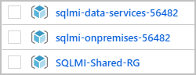

7.  Select resource group starting with **sqlmi-data-services-**

8.  From the overview blade of the Resource group, **select** the resource with
    type **Data Factory (V2)** from the resources:  
    

    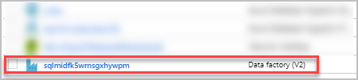

9.  From the overview blade of the Data Factory, navigate to the Author &
    Monitor tile to open the Data Factory user Interface (UI) on a separate tab.

    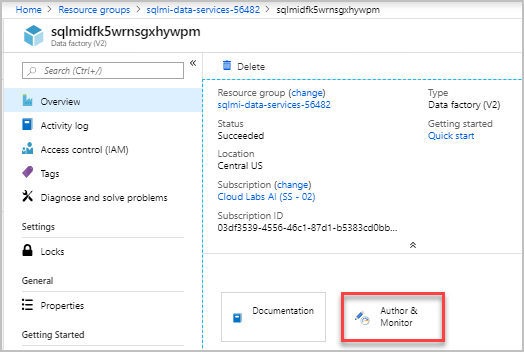

10. On the **Let's get started** page, click the **Configure SSIS Integration
    Runtime** tile

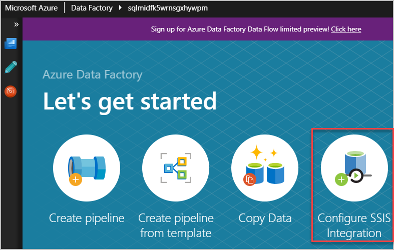

1.  On the **General Settings** form of Integration Runtime Setup page, enter
    the following information:

    1.  **Name:** integrationRuntime1

    2.  **Description:** Leave blank

    3.  **Location:** Select **location of the resource group** from the
        dropdown

>   **NOTE:** The location does not need to be that of your data factory's, but
>   it should be the same as your Azure SQL Database/Managed Instance server's
>   where your **SSISDB** is to be hosted, allowing easy access without
>   incurring excessive traffic.

1.  **Node Size:** Select **Standard_E8_v3** from the dropdown \*This node's
    high memory-to-CPU ratio results in superior performance when working
    with **large database servers** - which this lab will. Another case where
    selecting a large node size would be beneficial is when you anticipate
    running **compute/memory-intensive SSIS packages**

2.  **Node Number:** Select **1** by using the slider. *The number of nodes you
    select determines the cluster size of your IR, which impacts performance
    when running parallel SSIS packages. Select a large cluster if you plan on
    running many packages in parallel*

3.  **Edition/License:** Select **Enterprise** from the dropdown, as it will
    allow the use of advanced/premium features on your integration runtime,
    showcasing various features during this lab

4.  **Save Money:** Click **No**

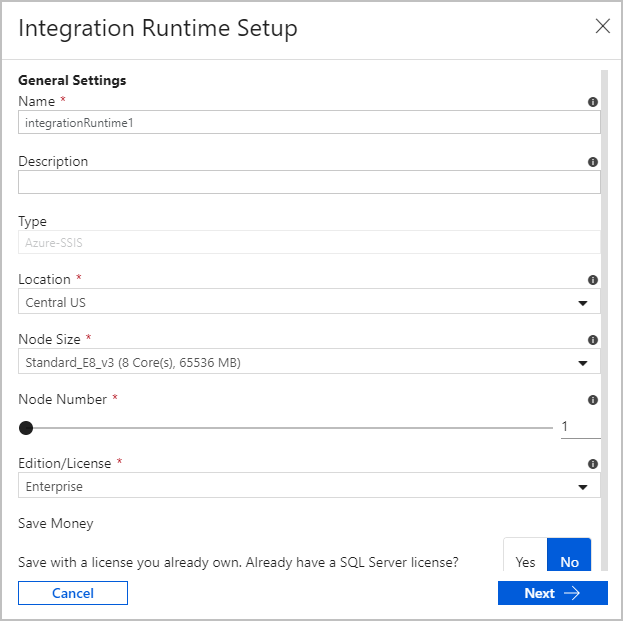

1.  Click **Next** to bring up the **SQL Settings** portion of Integration
    Runtime Setup page, and provide the following information:

2.  **Subscription:** Select your default subscription

3.  **Location:** Select your resource group location from the dropdown, as it
    is recommended that you select the same location of your integration runtime

4.  **Catalog Database Server Endpoint:** Select the available Database Server
    Endpoint from the Dropdown.

5.  **Do not** check **Use AAD authentication with your ADF MSI**

6.  **Admin Username:** contosoadmin

7.  **Admin Password:** **IAE5fAijit0w\^rDM**  
      
    

    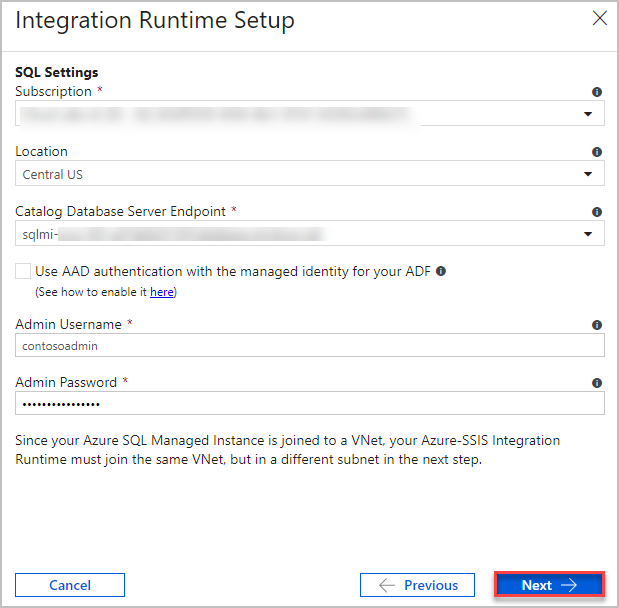

8.  **Maximum Parallel Executions Per Node:** select **1** from the dropdown box

>   **NOTE:** the maximum number of packages to execute concurrently per node in
>   your integration runtime cluster. Only supported package numbers are
>   displayed. Select a low number, if you want to use more than one cores to
>   run a single large/heavy-weight package that is compute/memory -intensive.
>   Select a high number, if you want to run one or more small/light-weight
>   packages in a single core.

1.  **Custom Setup Container SAS URI:** Leave blank

2.  **Select a VNet...:** Leave checked

>   **NOTE:** Selecting whether you want to join your integration runtime to a
>   virtual network: You should check it if you use Azure SQL Database with
>   virtual network service endpoints/Managed Instance to host SSISDB or require
>   access to on-premises data.

1.  Select the subscription from the dropdown.  
    

    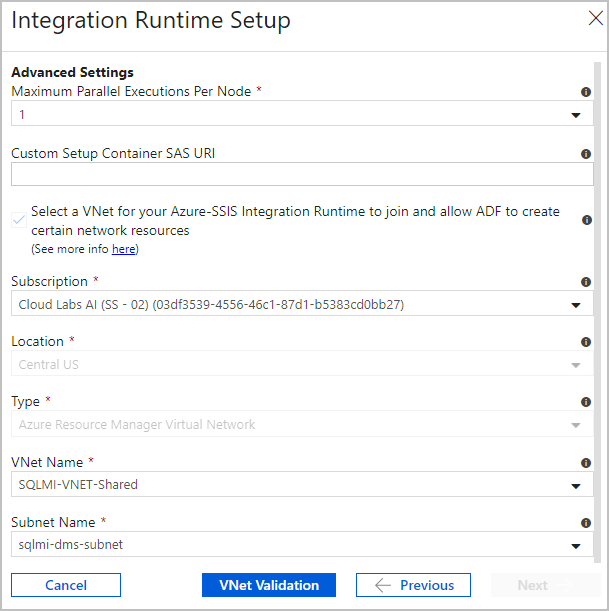

2.  Click **VNet Validation** and if successful, click **Next**   
    

    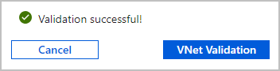

3.  Click **Finish** to start the creation of your integration runtime  
    

    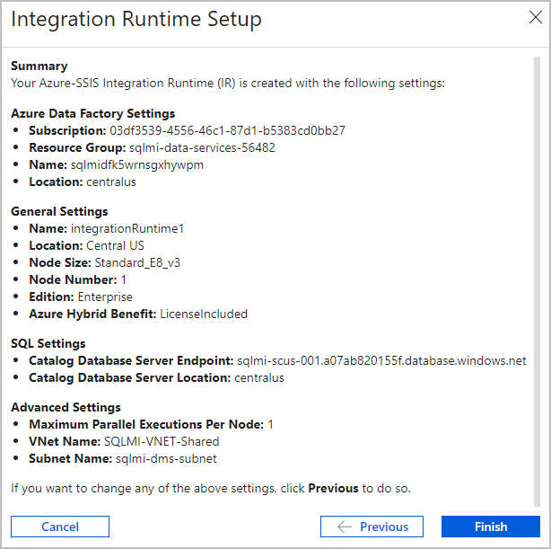

4.  On the **Connections** tab, switch to **Integration Runtimes** if needed.
    Select **Refresh** to refresh the status  
    

    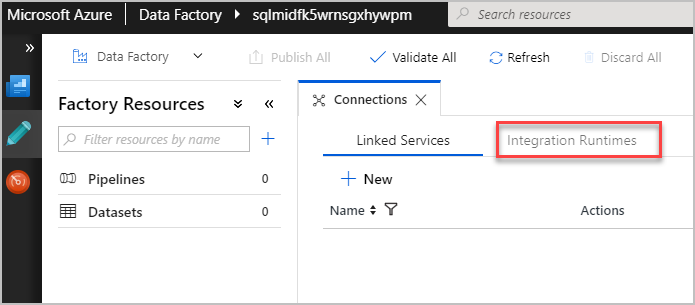

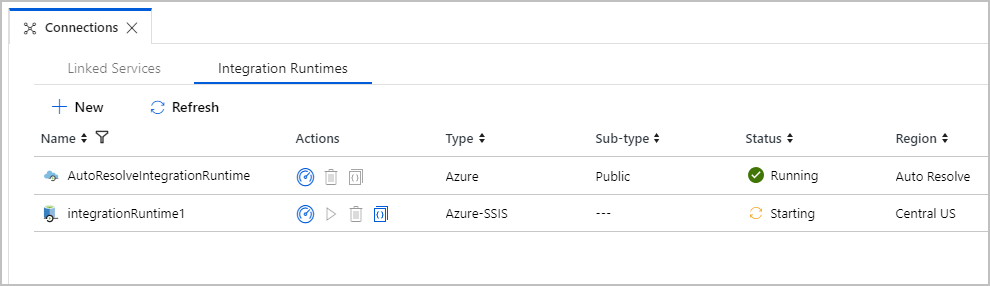

>   **NOTE:** This process takes approximately **20 to 30 minutes** to complete
>   due to the Azure Feature Pack for SSIS and the Access Redistributable
>   installations. This is taking place while the Data Factory service connects
>   to your Azure SQL Database server to prepare the **SSIS Catalog** (SSISDB
>   database).

>   **NOTE:** Use the links in the **Actions** column to stop/start, edit, or
>   delete the integration runtime. Use the last link to view JSON code for the
>   integration runtime. The edit and delete buttons are enabled only when the
>   IR is stopped.

1.  Please continue with the lab while the integration runtime installs

2.  Once the process completes the status of the integrationRuntime1 changes to
    Running.  
    

    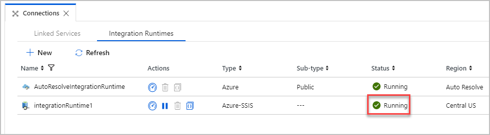

Exercise 2: Use the Copy Data Tool to Create and Run Data Pipeline
------------------------------------------------------------------

### Overview

I

#### Task 1: 

1.  On the left-hand column of the screen, click the blue **Data
    Factory** icon to return to the home screen  
    

    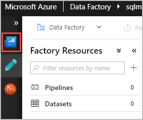

2.  On the **Let's get started** page, select the **Copy Data** tile to launch
    the **Copy Data tool**  
    

    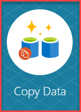

3.  On the **Properties** page, under **Task name**, enter
    **CopyFromAzureSQLDBtoDataWarehouse,** then select **Next**  
    

    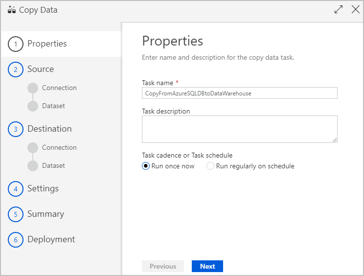

4.  On the **Source data store** page, click **+ Create new connection**  
    

    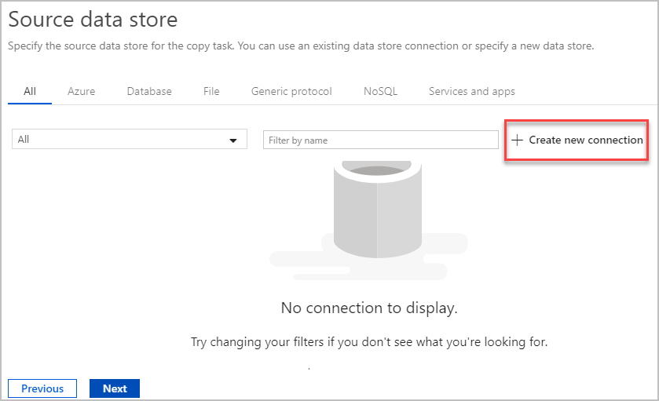

5.  Select **Azure SQL Database Managed Instance** from the gallery, and then
    select **Continue**  
    

    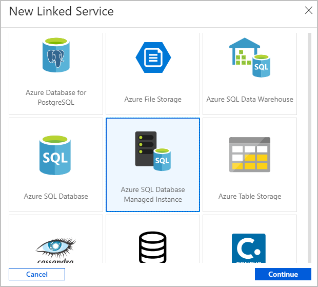

6.  On the New Linked Service page, enter the following information:

    1.  **Name:** Enter **CopySourceService**

    2.  **Description:** Leave blank

    3.  **Connection via Integration
        Runtime:** Select **AutoResolveIntegrationRuntime**

    4.  **Connection String or Azure Key Vault:** Select **Connection String**

    5.  **Account Selection Method:** Select **From Azure subscription**

    6.  **Azure subscription:** select **default subscription**

    7.  **Server name:** Provide SQL MI Server

    8.  **Database Name:** Provide **the database name of the database you
        migrated**

    9.  **Authentication Type:** Select **SQL Authentication**

    10. **User name:** contosoadmin

    11. **Password:** **IAE5fAijit0w\^rDM**

    12. **Click on Test**

    13. Click **Finish**

7.  Select the newly created linked service as source, then click **Next**

8.  On the **Select tables from which to copy the data or use a custom
    query** page, select the Table **[Purchasing].[PurchaseOrders]**, then
    click **next**

9.  On the **Destination data store** page, click **+ Create new connection** to
    add a connection

10. Select **Azure SQL Data Warehouse** from the gallery, and then
    select **Continue**

11. On the **New Linked Service** page, enter the following information:

12. **Name:** Enter **CopyDestinationService**

13. **Description:** Leave blank

14. **Connection via Integration
    Runtime:** Select **AutoResolveIntegrationRuntime**

15. **Connection String or Azure Key Vault:** Select **Connection String**

16. **Account Selection Method:** Select **From Azure subscription**

17. **Azure subscription:** select 

18. **Server name:** Provide SQL MI Server Name

19. **Database Name:** Select **DataWarehouse-**

20. **Authentication Type:** Select **SQL Authentication**

21. **User name:** Enter **LabUser**

22. **Password:** Enter 

23. Click **Finish**

24. Select the newly created linked service as sink, then click **Next**

25. On the **Table mapping** page, select **Next**

26. On the **Column mapping** page, select **Next**

27. On the **Settings** page, Uncheck **Enable Staging**, and **Allow polybase**

28. Click **Next**

29. On the **Summary** page, review the settings, and then select **Next**

30. On the **Deployment** page, select **Monitor** to monitor the pipeline
    (task)

>   **NOTE:** Notice that the Monitor tab on the left is automatically selected.
>   The Actions column includes links to view activity run details and to rerun
>   the pipeline

Exercise 3: Deploy and Run SSIS Packages from Azure Data Factory SSIS IR
------------------------------------------------------------------------

### Overview

I

#### Task 1: 

Verify the Integration Runtime you created earlier in the lab has completed.

1.  On the monitor page, click the **Integration Runtimes** tab near the top of
    the page

2.  Verify that **MyFirstIntegrationRuntime**has a Status of **Running**, If its
    status is **Starting** then wait for the Runtime to complete before
    continuing.

>   **NOTE:** Click the refresh button to update the status

>   **NOTE:** This process takes approximately **20 to 30 minutes**

### Connect to SSISDB

To deploy and then run the package on Azure SQL Database, you'll need to
first **connect** to the SSIS Catalog database (SSISDB). To do so, complete the
following steps:

1.  Double click **SSMS** icon on desktop to launch **SQL Server Management
    Studio**

2.  In the **Connect to Server** dialog box, enter the following information:

3.  **Server name:** **azuresql-\<**

4.  **Authentication:** Select **SQL Server Authentication**, as you cannot
    connect to an Azure SQL Database with Windows authentication

5.  **Login:**  **LabUser**

6.  **Password:** 

7.  Click the **Options** button

8.  Click on the **Connection Properties** tab

9.  Click on the dropdown for selecting a **database**

>   **NOTE:** If a dialogue box appears and asks to connect first,
>   click **Yes**.

1.  Click **SSISDB** and make sure it's highlighted

2.  Click **OK**

3.  Click **Connect**

4.  In the **Object Window** on your left, navigate to **Integration Services
    Catalogs** and click the **Expand Object** icon (plus sign "+"), then expand
    the **SSISDB** object as well

#### Deploying a Project/Package

1.  Right click on **SSISDB**, select **Create Folder**

2.  Name the folder **Myproject**, click **ok**

3.  Click on the **Projects** node

4.  Right-click on the **Projects** node and select **Deploy project** to launch
    the **Services Deployment Wizard**

>   **NOTE:** You can deploy a project from the current catalog **or** from the
>   file system.

1.  On the **Introduction** page of the wizard, review the introduction, then
    click **Next** to open the **Select Source** page

2.  On the **Select Source** page, select **Project deployment file** and enter
    **C:\\temp\\Daily.ETL.ispac**

>   **NOTE:** To deploy a project that is already deployed to an SSIS catalog
>   database, select **Integration Services** catalog, and then enter the server
>   name and the path to the project in the catalog.

1.  On the **Select Destination** page, select

Enter the following information as the **User name** and **Password**:

1.  Click Next

2.  **User name:** **LabUser**

3.  **Password:** **\<inject key="AzureAdUserPassword"\>\</inject\>**

4.  Click **Connect**

5.  Click **Next** after you **Connect**

6.  On **Validate** page, click Next

7.  On the **Review** page, review the settings you selected

8.  Click **Deploy** to start the deployment process

9.  Once complete, the **Results** page will display successes and/or failures
    of any actions. Once complete, click **Close** to exit the wizard

#### Running a Package

1.  Refresh the **Projects** folder in SSMS

2.  Select **Daily ETL**

3.  Right-click and select **Execute**

4.  After the **Execute Package** dialog box opens, click the **Connection
    Manages** tab

5.  Edit the values for **Password**, **ServerName**, and **Username** on the
    Destination and Source Databases

6.  Click on the Destination DB name **WWI_DW_Destination_DB** to change the
    settings

7.  Change the Password to by clicking the **...**on the **Password** field

8.  Change the ServerName to by clicking the **...** on the **ServerName** field

9.  Change the UserName to **Labuser**by clicking the **...** on
    the **UserName** field

10. Click on the source DB name **WWI_Source_DB** to change the settings

11. Change the Password to by clicking the **...**on the **Password** field

12. Change the ServerName to **database.windows.net** by clicking the **...** on
    the **ServerName** field

13. Change the UserName to **LabUser** clicking the **...** on
    the **UserName** field

14. Click **OK** to run the package

15. Click **yes** to open **Execution Report** to review

Exercise 4: Power BI
--------------------

### Overview

I

#### Task 1: 

1.  Double click **Power BI Desktop** icon on desktop to launch **Power BI
    Desktop**

2.  Upon opening the window, a **Welcome to Power BI Desktop** pop-up will
    appear. Complete the form as follows:

3.  **First Name:** Enter Your First Name

4.  **Last Name:** Enter **Your Last Name**

5.  **Email Address:** Enter 

6.  **Enter your phone number:** Enter **555-555-5555**

7.  **Country/region:** Select **United States**

8.  **Company name:** Enter **Contoso Inc**

9.  **Company size:** Select **1000+**

10. **Job Title:** Select **Other**

11. Click **Done**

>   **Note:** If Power BI Desktop doesn't display a screen
>   showing **Success!** within 30 seconds, you may need to click **Turn on
>   protected mode** on the bottom of your application browser.

1.  Exit out of the browser inside the application once it displays **Success!**

2.  On the opening screen for Power BI Desktop, click **Get data**, 

3.  On the **Get Data** blade, click on **SQL Server database**

>   **Note:** This mimics the connection requirements for our datawarehouse to
>   be able to communicate with Power BI the same way a SQL Server database
>   would.

1.  Click **Database**, then **SQL Server database**

2.  Click **Connect**

3.  Enter for the **Server** box

4.  Make sure **Import** is selected under **Data Connectivity mode**

5.  Click **OK**

6.  On the left-hand side of the window, click the **Database** tab

7.  For the **User name** enter LabUser

8.  **Password:** 

9.  Select **DataWarehouse**, Check the box next
    to **Purchasing.PurchaseOrders**

10. Click **Load**

11. On the left hand column of the screen, click the upper-most of the three
    icons, which when hovered over with the cursor, should display "Report",
    click **Report**

12. On the right hand side of the screen, under the **Visualizations** header,
    click the upper left-hand icon titled **Stacked bar chart**, drag the icon
    onto the blank canvas in the middle of the screen

13. Under the **Fields** header to the right of the Visualizations menu, click
    both the **OrderDate** and **SupplierID** checkboxes

#### Stop the Azure-SSIS Integration Runtime

1.  On the desktop open a web browser and navigate to
    \<copy\><https://portal.azure.com/> \</copy\>

2.  Navigate to your Azure Data Factory: **DataFactory**

3.  Click the **Author & Monitor** tile to open the Data Factory user interface
    (UI) on a separate tab

4.  On the left hand side navigation bar, click the pen icon (Author) 

5.  On the Factory Resources page, near the bottom, click
    the **Connections** button 

6.  When the Connections tab is displayed, click the **Integration
    Runtimes** tab

7.  Click the Pause\\Stop button in the Actions section of
    the **MyFirstIntegrationRuntime** to stop the service

8.  When asked "Are you sure you want to Stop integration runtime",
    click **Stop**

Conclusion
----------

#### In this lab you've learned how to create and configure Integration Runtimes in Azure Data Factory to facilitate cloud-based execution, modification, and monitoring of natively hosted SSIS packages. Then, you've learned how to create a simple yet robust data pipeline to create a reliable data copying strategy. Finally, you learned how the entire process comes together for the end-user by connecting the output data to Power BI Desktop, where you can create and visualize various reports and dashboards to gain insight into your data.
